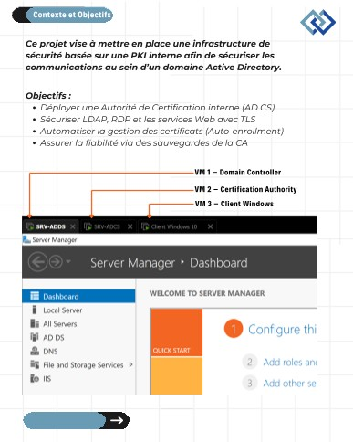
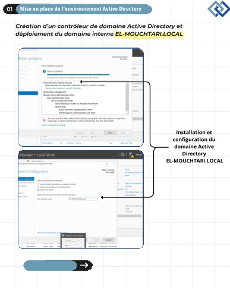

# Active Directory PKI with Microsoft AD CS

An internal Public Key Infrastructure (PKI) project that secures an Active Directory environment through centralized certificate management, automated enrollment, encrypted directory access, and certificate-based remote access protection.

## Project Overview

The project transforms the `EL-MOUCHTARI.LOCAL` Active Directory environment into a more secure and automated infrastructure using Microsoft Active Directory Certificate Services (AD CS).

## Tech Stack

- Microsoft Active Directory Certificate Services (AD CS)
- Active Directory
- Group Policy (GPO)
- Enterprise Root CA
- LDAP / LDAPS
- RDP
- SSL/TLS certificates
- Windows Server

## Key Features

- Deployed an Enterprise Root Certification Authority for centralized digital identity management.
- Configured certificate auto-enrollment through Group Policy for domain users and computers.
- Migrated directory traffic from LDAP to LDAPS to protect Active Directory queries with TLS.
- Secured RDP access with SSL/TLS certificates to reduce certificate warnings and mitigate man-in-the-middle risks.
- Implemented backup and restore procedures for the CA database and private key.

## My Role

Designed and implemented the PKI architecture, certificate automation, protocol hardening, and CA recovery strategy.

## Result

The implementation centralized certificate management, automated certificate deployment, protected LDAP and RDP communications, and added recovery readiness for the certification authority.

## Screenshots

## Setup and Run

[NEEDS INFO]

Configuration files, scripts, and detailed deployment instructions were not included in the provided project source.

## Source

- [LinkedIn project post](https://www.linkedin.com/posts/achraf-el-mouchtari-853672344_projet-technique-s%C3%A9curisation-de-linfrastructure-activity-7432348786020040705-n2_-)

## Author

Achraf El Mouchtari

- GitHub: [elmouchtari-achraf](https://github.com/elmouchtari-achraf)
- LinkedIn: [Achraf El Mouchtari](https://www.linkedin.com/in/achraf-el-mouchtari-853672344/)
